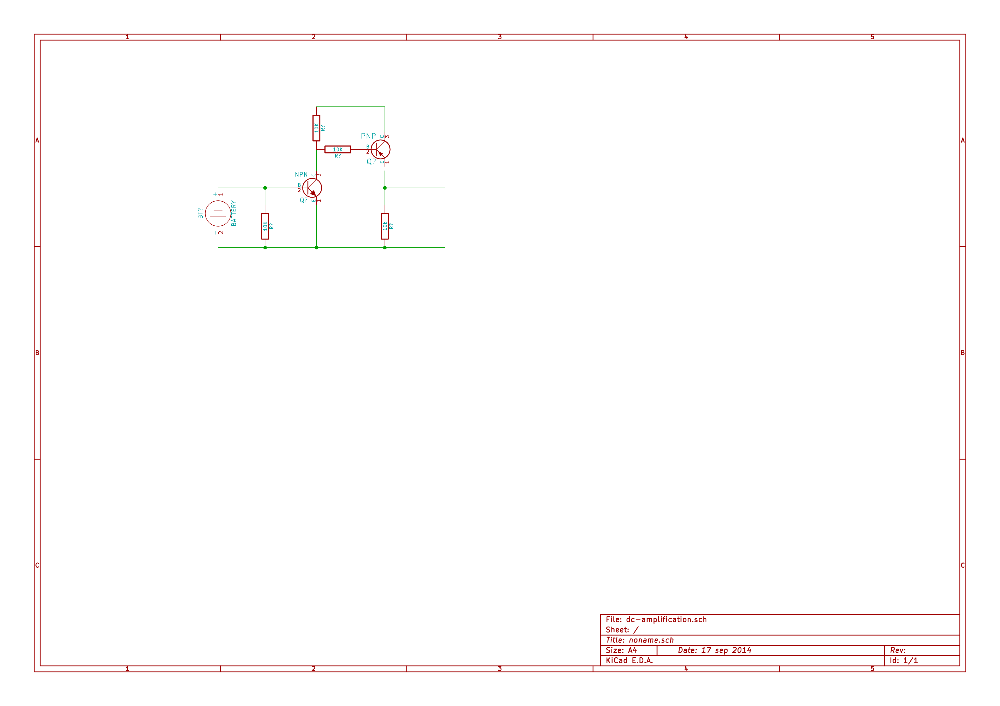
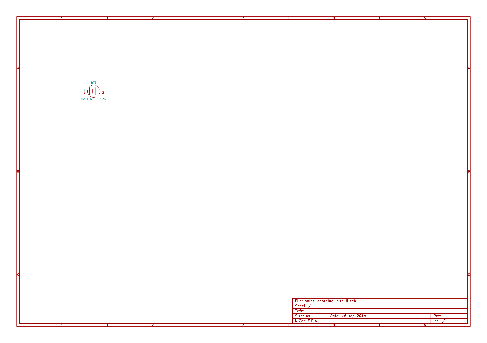

# Solar-Charging-Circuit

实现在太阳能电池的输出电压小于蓄电池端电压的情况下（但不能小于蓄电池端电压的1/2）实现充电过程

## Plot

### DC 放大电路



### Solar Charging Circuit



## Requirements

```bash
sudo apt-get install kicad inkscape
```

KiCad 是开源的跨平台 EDA 软件。非常不错哦。

## Convert SVG 2 PNG

```bash
inkscape -f solar-charging-circuit.svg -e solar-charging-circuit.png
```

## Links

- http://wenku.baidu.com/view/f71bad4033687e21af45a95e.html
